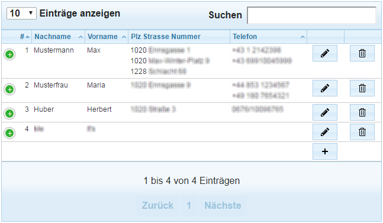
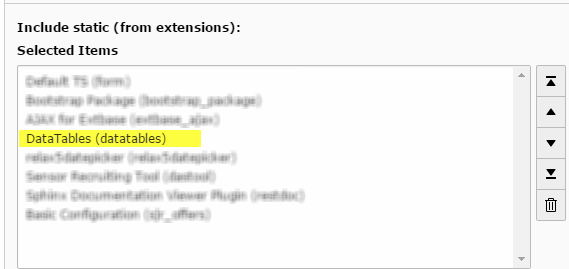

.. ==================================================
.. FOR YOUR INFORMATION
.. --------------------------------------------------
.. -*- coding: utf-8 -*- with BOM.

.. include:: ../Includes.txt

.. _admin-manual:

Administrator Manual
====================

The extension is intended to give you a quick possibility to render your data in a table view. THe configuration is done via FlexForms in the content element holding the plugin itself.

	Sample view

The plugin will provide the following features:

* Select the attribute values to be displayed in the respective columns
* Show values of child objects
* Collapse multiple properties of child objects to one table cell
* Adjust alignment
* Add buttons for adding and editing and/or deleting records
* Add buttons for bulk delete actions
* Provide automatic responsive view
* Allow paging of result set
* Search and sort records

Target group: **Administrators**

Installation
------------

Install the extension in the usual way and include the static template in the template of your root page (or at least in the template of the page where you want to use the plugin). If you want to render the table view generated by datatables only for a single extension, you can set the *Default Storage PID* in the constant editor.

	Include static template

Please go to the :ref:`UsersManual/Index` part for configuration options.

:ref:`../UsersManual/General`
