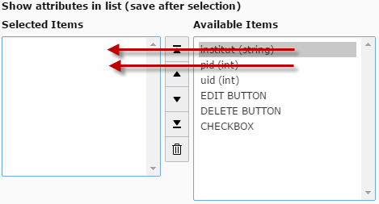
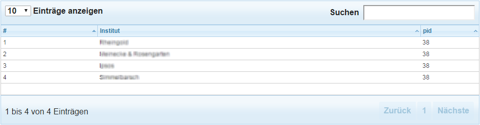
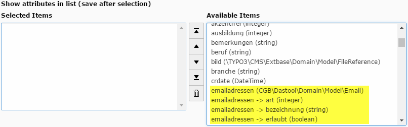
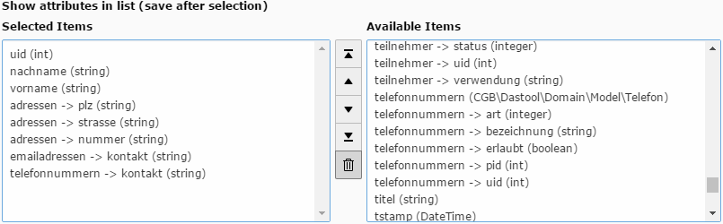
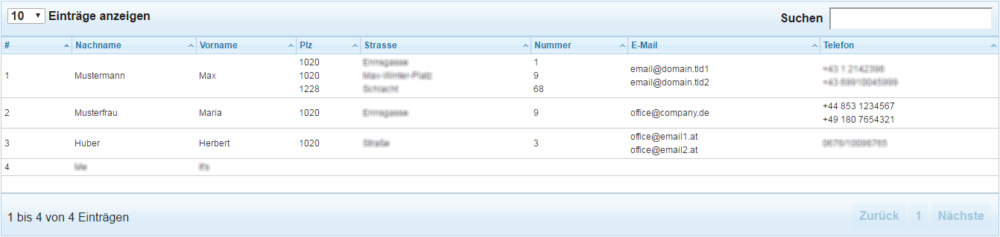

.. ==================================================
.. FOR YOUR INFORMATION
.. --------------------------------------------------
.. -*- coding: utf-8 -*- with BOM.

.. include:: ../Includes.txt

.. _users-manual-configuration:

Configuration
=============

The configuration page consist of the following settings for the plugin:

* Show attributes in list (save after selection)
* List of sub properties to be collapsed in a subtable
* Field details

For a very simple datatbles view you simply add some of the attributes on the right side of the attribute/property list and add them to the selected values box. That's all.

PLease have a look at the frontend view sample above: The table will be rendered automatically. Filtering and sorting is enabled and will make the calls to the backend by using AJAX thus speeding up the rendering of the table even in large datasets.

Additional settings allow a better configuration of the output of nested domain objects. If you want to display a list of domain objects with child objects and n:1-relations (e.g. select lists) you will see something similar to the following screenshot in order to pick the required properties and attributes:

Please note that you will see the object type in parantheses next to the property name. If the property is not a plain attribute but a child object or a storage object the select box will show you the attributes and properties of the child object(s). You don't have to care wether it is a storage object or a domain object. Just go ahead and add the properties of the child object you want to appear in the frontend table view. If the child object contains other objects the process will list allo the childs recursively.

THe above example shows a sample selection of child objectes. The fields **uid, nachname and vorname** are plain attributes. But **plz, strasse, nummer** (zip, street addresss and number) come from child objects **adressen.** Email and phonenumber are displayed in a similar way. The resulting frontend view will be something like this:

Please note that all the child objects will be listed inside the table. As you can see all the elements are vertically aligned to the middle, that's why it is a good idea to check the **align to top** checkbox on the General tab.

Further configuration allows you to:

* Disable sorting of nested objects (which is not possible at the moment)
* Collapsing elements of a child storage object into one table cell
* Limiting the display to only the first child of the child objects
* Set display options for responsive rendering
* Adding a custom class to the table cell

Please note that this table is already behaving responsively.

List of sub properties to be collapsed in a subtable
----------------------------------------------------

Enter the name (or a comma separated list of names) of an object storage here. The properties of the corresponding child elements will be collapsed together in one field.

Individual Settings for Property
--------------------------------

The following settings may be added individually to each selected property:

* Custom title
* Select property
* Align in table
* Show Column always (responsive)
* Disable sorting in datatables
* Show first child only
* Class

To add a new individual setting press the **+ Field detail** button. At the moment (Typo3 7.6) there is now way, that the flexform will show the settings collapsed and with a title. Use the **Toggle all** button and the **Custom title** field for a better overview.

Custom title
^^^^^^^^^^^^
Add a title for your setting. This will appear nowehere in the frontend but displayed only in collapsed state of the flexform record.

Select property
^^^^^^^^^^^^^^^
Select the property of out the selected properties for which the setting will apply.

Align in table
^^^^^^^^^^^^^^
You can set the value to **left**, **center** or **right**. Center setting is recommended for the EDIT BUTTON, DELETE BUTTON and CHECKBOX elements or any elements looking better if aligned to the center. Right is recommended for record uid or any numbers.

Show Column always (responsive)
^^^^^^^^^^^^^^^^^^^^^^^^^^^^^^^
THis is a recommended setting for the buttons (DELETE and EDIT) as well. The reason is, that the applied jQuery settings to make those elements buttons will not appliy if the column "disappears" due to screen limitations and will be visible only if the detail section is activated.It might be a good idea as well to appliy this setting to record uid or the basic identification attribute as **name** or **title.** Thte setting is only relevant for styling purposes in responsive rendering.

Disable sorting in datatables
^^^^^^^^^^^^^^^^^^^^^^^^^^^^^
This setting is useful to disable the sorting arrows to the right of the table header. It will be automatically set for the action buttons. But it should be set also for the headers of the child objects.

Show first child only
^^^^^^^^^^^^^^^^^^^^^
If the child objects is a actually an object storage then in some cases it might be useful to display only the first child of the storage. If you have the sorting option turned on in your extension the sort order will be respected.

Class
^^^^^
Add a custom class name to the table cell.