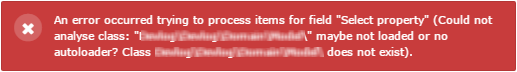

.. ==================================================
.. FOR YOUR INFORMATION
.. --------------------------------------------------
.. -*- coding: utf-8 -*- with BOM.

.. include:: ../Includes.txt

.. _users-manual-general:

General configuration
=====================

The general configuration consist of the following settings for the plugin:

* Consider extensions from following vendors (comma separated list)
* Domain object for list view
* Enable AJAX calls (requires extbase_ajax)
* Action pageUid
* Action to be called on edit (default: edit)
* Action to be called on new (default: new)
* Action to be called on delete (default: delete)
* Action to be called on bulkdelete (default: delete)
* Set vertical alignment of tablecells to top

Consider extensions from following vendors (comma separated list)
^^^^^^^^^^^^^^^^^^^^^^^^^^^^^^^^^^^^^^^^^^^^^^^^^^^^^^^^^^^^^^^^^
This setting limits the listed repositories to one or more specific vendors like a filter. This is useful, if you want to use the datatables extensions within your own project (as I do). Enter a comma separated list of vendors. The names are case sensitive. Press save button on top to activate this setting.

Domain object for list view
^^^^^^^^^^^^^^^^^^^^^^^^^^^
Choose the repository you want to use as the main aggregate domain object of your table view. If you receive a class loader error here, it basically means that you cannot use this repository for datatables extension at the moment.

Enable AJAX calls (requires extbase_ajax)
^^^^^^^^^^^^^^^^^^^^^^^^^^^^^^^^^^^^^^^^^
At the moment the extension extbase_ajax is under review. It allows to embed AJAX calls to controller actions by generating the necessary code for e.g. editing or creating a record.It will change the gfeneration of the code wrapping the buttons and links in the frontend. If you check this, you will probably not be able to edit or delete records. **This setting does not affect the background calls to the repository itself. This will be performed using the id 1200.** For details see the technical explanation.

Action pageUid
^^^^^^^^^^^^^^
It is most likely that you will place the plugins for editing the records of your repository on a different page. The reason is that you probably dont want to loose your table view and be able to return to your search easily. At the moment this is accomplished by simply obening a new tab for editing purposes (if aboive setting is NOT enabled). If you add an EDIT BUTTON to your list, set this to a page where you put the plugin of your extension which will be able to handle the controller actions.

Action to be called on edit (default: edit)
^^^^^^^^^^^^^^^^^^^^^^^^^^^^^^^^^^^^^^^^^^^
The name of the edit controller action. This name is **edit** by default. In order to allow editing, the corresponding method must appear in the controller of the domain object. This will be the case if your extension is generated by using the Extension Builder.

Action to be called on new (default: new)
^^^^^^^^^^^^^^^^^^^^^^^^^^^^^^^^^^^^^^^^^
Same as above for creating records.

Action to be called on delete (default: delete)
^^^^^^^^^^^^^^^^^^^^^^^^^^^^^^^^^^^^^^^^^^^^^^^
Same as above for deleting records.

Action to be called on bulkdelete (default: delete)
^^^^^^^^^^^^^^^^^^^^^^^^^^^^^^^^^^^^^^^^^^^^^^^^^^^
Same as above for bulk deleteing records. This action will not be present by default. The bulk delete action will pass a comma separated list of record uid values to be deleted. Since I use a modified delete controller action this will be understood. If you want to use your own, set this value to bulkdelete and provide a controller action called bulkdeleteAction. Don't forget to register the new action in your plugin settings or switchable controller list if handled by flexforms.

Set vertical alignment of tablecells to top
^^^^^^^^^^^^^^^^^^^^^^^^^^^^^^^^^^^^^^^^^^^
If the plugin is set to display child objects, it is recommended to set the vertical alignment to "top". This can be done either by adding a custom css rule or by simple activating this checkbox.
