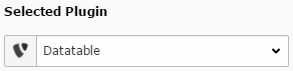

.. ==================================================
.. FOR YOUR INFORMATION
.. --------------------------------------------------
.. -*- coding: utf-8 -*- with BOM.

.. include:: ../Includes.txt

.. _users-manual:

Users manual
============

Create a new content element and set the selected plugin to *Datatable*.

You will need to select a domain object repository and at least one attribute/property to be displayed in the frontend. Next you will have to set the page id of the page where the records are saved.

The configuration is split up into two tabs: General and Configuration. On the general tab you will be able to set the general options for the plugin like the domain model object, the names of the controllers to be executed and so on. The configuration tab allows you to select the attributes/properties to be displayed and add individual settings for each field.

